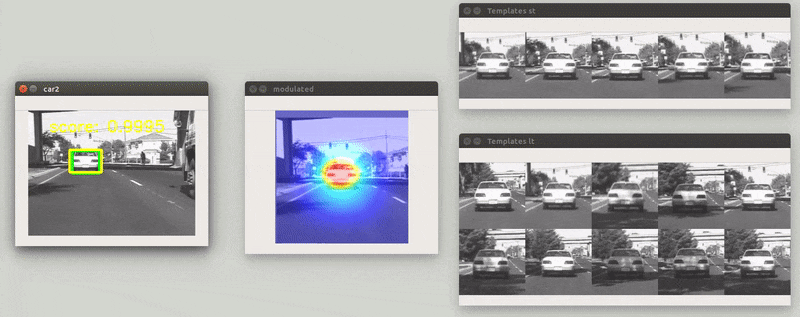
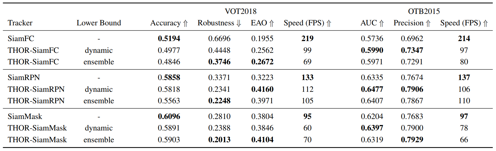

# Tracking Holistic Object Representations #

[](https://paperswithcode.com/sota/visual-object-tracking-on-vot201718?p=tracking-holistic-object-representations)

#### in BMVC 2019 [[PDF]](https://arxiv.org/pdf/1907.12920.pdf) [[Video]](https://www.youtube.com/watch?v=EAv7SvI3EH0&feature=youtu.be) [[Project]](https://sites.google.com/view/vision-thor/)

[Axel Sauer*](https://axelsauer.com/),
[Elie Aljalbout*](https://www.msrm.tum.de/rsi/team/wissenschaftliche-mitarbeiter/aljalbout-elie/),
[Sami Haddadin](https://www.msrm.tum.de/rsi/team/professor/)

Munich School of Robotics and Machine Intelligence, Technical University of Munich

<p align="center">
  
</p>


If you use this implementation, please cite our BMVC 2019 paper.
```
@inproceedings{Sauer2019BMVC,
  author={Sauer, Axel and Aljalbout, Elie and Haddadin, Sami},
  title={Tracking Holistic Object Representations},
  booktitle={British Machine Vision Conference (BMVC)},
  year={2019}
}
```

## Installation

```Shell
# install anaconda if you don't have it yet
wget https://repo.continuum.io/archive/Anaconda3-5.3.0-Linux-x86_64.sh
bash Anaconda3-5.3.0-Linux-x86_64.sh
source ~/.profile
# or use source ~/.bashrc - depending on where anaconda was added to PATH as the result of the installation
```

Clone the repo, build the environment and build the benchmark toolkits

```Shell
git clone https://github.com/xl-sr/THOR.git
cd THOR

# create the conda environment
conda env create -f environment.yml
conda activate THOR

# build the vot toolkits
bash benchmark/make_toolkits.sh
```

## Get the Models
The .pth for SiamFC is already in the repo since it is small. The SiamRPN and SiamMask models need to be downloaded and moved to their respective subfolder.

**SiamRPN**

get model [here](https://drive.google.com/file/d/1-vNVZxfbIplXHrqMHiJJYWXYWsOIvGsf/view) &rarr; move to ./trackers/SiamRPN/model.pth

**SiamMask**

download the model and move to subfolder
```
wget http://www.robots.ox.ac.uk/~qwang/SiamMask_VOT.pth
mv SiamMask_VOT.pth trackers/SiamMask/model.pth
```

## Get the Datasets
Run the download script to get the [OTB2015](http://cvlab.hanyang.ac.kr/tracker_benchmark/benchmark_v10.html) and [VOT2018](http://www.votchallenge.net/vot2018/) datasets
```
cd data/
bash get_test_data.sh
```

## Reproduce the benchmark results
<p align="center">
  
</p>

To reproduce the benchmark results from the paper run for example:
```
# on VOT2018, with THOR (ensemble) enabled, using SiamRPN
python bench.py -d VOT2018 -t SiamRPN --lb_type ensemble

# on VOT2018, with THOR disabled, using SiamRPN
python bench.py -d VOT2018 -t SiamRPN --vanilla
```
Option     | |
-------- | ---
``-d DATASET, --dataset DATASET``| ``(Required) Dataset on which the benchmark is run [VOT2018, OTB2015]``
``-t TRACKER, --tracker TRACKER``| ``(Required) Name of the tracker [SiamFC, SiamRPN, SiamMask]``
``--vanilla``| `` Run the tracker without THOR``
``-v, --viz``| `` Show the tracked scene, the stored templated and the modulated view``
``--verbose``| `` Print additional info about THOR``
``--lb_type LOWER_BOUND``| `` Specify the type of lower bound [dynamic, ensemble]``
``--spec_video VIDEO_NAME``| `` Pick a specific video by name, e.g. "lemming" on OTB2015``
``--save_path PATH``| `` Relative path where the tracked trajectory should be saved``

## Webcam demo
<p align="center">
  
</p>

To run THOR on your webcam / camera, run the following command
```
# with THOR (ensemble) enabled, using SiamRPN
python webcam_demo.py --tracker SiamRPN

# with THOR disabled, using SiamRPN
python webcam_demo.py --tracker SiamRPN --vanilla
```

Option     | |
-------- | ---
``-t TRACKER, --tracker TRACKER``| ``(Required) Name of the tracker [SiamFC, SiamRPN, SiamMask]``
``--vanilla``| `` Run the tracker without THOR``
``-v, --viz``| `` Show the stored templated and the modulated view``
``--verbose``| `` Print additional info about THOR``
``--lb_type LOWER_BOUND``| `` Specify the type of lower bound [dynamic, ensemble]``

## Acknowledgments
The code (with some modifications) and models of the trackers are from the following linked repositories:

[SiamFC](https://github.com/huanglianghua/siamfc-pytorch),
[SiamRPN](https://github.com/foolwood/DaSiamRPN),
[SiamMask](https://github.com/foolwood/SiamMask)
